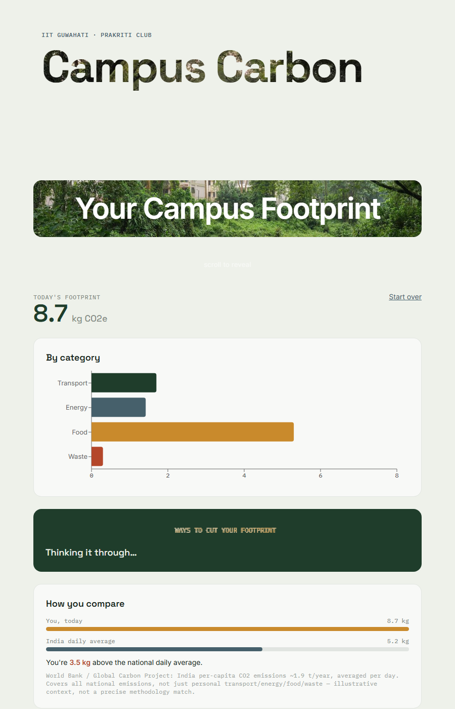
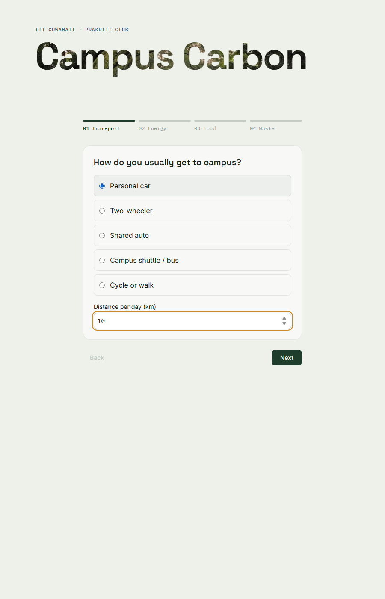
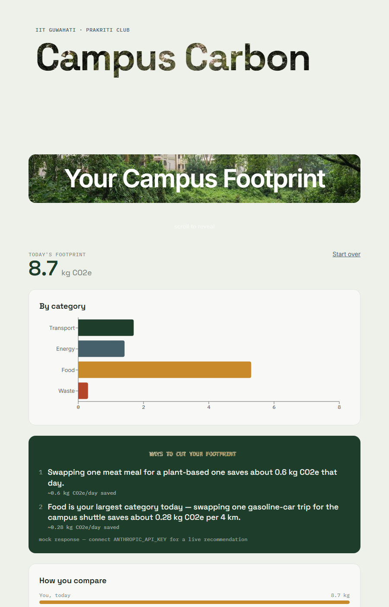
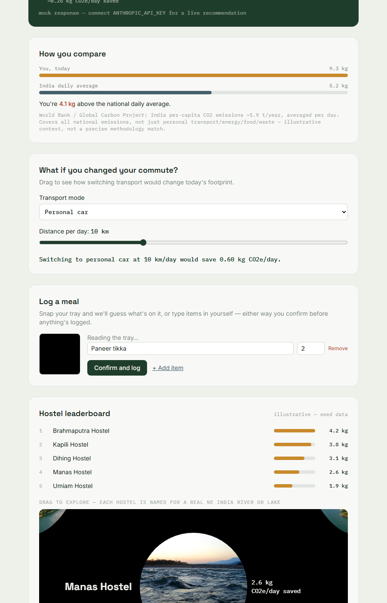
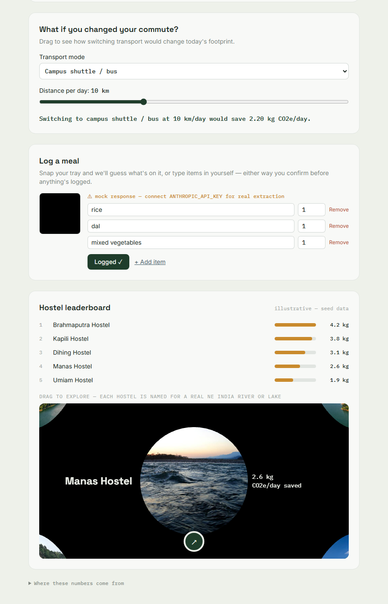

# Urban Carbon Footprint Calculator

A campus carbon footprint calculator built for **Avinya 2026: Prakriti EcoInnovate
Challenge** (Prakriti × Techniche, IIT Guwahati) — Problem Statement #2. It measures
a student's daily carbon footprint across transport, energy, food, and waste, then
uses Gemini to turn those numbers into personalized, ranked reduction strategies —
grounded in a deterministic emissions engine, not invented by the model.



## What it does

- **4-step onboarding** — transport, energy, food, and waste habits, in under a minute
- **Live dashboard** — total footprint, category breakdown chart, and a comparison
  against the India daily per-capita average (sourced, labeled illustrative)
- **AI-grounded recommendations** — Gemini turns an already-computed footprint
  breakdown into 2–3 ranked strategies with concrete kg CO₂e/day savings; it never
  invents the numbers, only explains and personalizes ones a deterministic Python
  engine already calculated
- **Meal logging, two ways** — snap a tray photo (Gemini vision extracts the items)
  or type them in manually, with autocomplete across 100+ Indian dishes — both land
  in the same editable list before anything is logged
- **What-if slider** — drag to see how switching transport mode would change
  today's footprint, recalculated live through the real calculation engine
- **Hostel leaderboard** — a ranked list plus a drag-to-rotate 3D sphere of the
  five hostels, each named after (and photographed as) a real Northeast India
  river or lake

<table>
<tr>
<td></td>
<td></td>
</tr>
<tr>
<td></td>
<td></td>
</tr>
</table>

## Why it's grounded, not a black box

Every number the app shows traces back to a sourced emission factor in
[`backend/data/emission_factors.py`](backend/data/emission_factors.py) — IPCC AR6,
US EPA GHG Emission Factors Hub, GHG Protocol / Poore & Nemecek (2018), and CEA
India's grid baseline. Every API response that includes a number also returns
what it was computed from, so a judge (or a curious user) can see exactly where
it came from — the dashboard's own "Where these numbers come from" panel shows
this directly. Gemini's two jobs are strictly: (1) extract structured food items
from a photo, and (2) explain/personalize numbers it's handed. It never computes
emissions math itself.

## Tech stack

- **Frontend:** React + Vite + TypeScript + Tailwind CSS + Recharts
- **Backend:** Python FastAPI, no database (stateless by design — every response
  is computed fresh, nothing is persisted)
- **AI:** Google Gemini (google-genai SDK) — vision extraction + text recommendations,
  with automatic mock-response fallback whenever no API key is set or a call fails,
  so the app never crashes because of the AI layer

## Running it locally

```bash
# Backend — port 8001 (not FastAPI/uvicorn's default 8000; see CLAUDE.md for why)
cd backend
pip install -r requirements.txt --break-system-packages
uvicorn api.main:app --reload --port 8001

# Frontend, in a second terminal
cd frontend
npm install
npm run dev
```

Open `http://localhost:5173`. The frontend proxies `/api` to the backend on 8001.

Runs fully on realistic mock AI responses out of the box — no API key required.
To use a live Gemini key, drop `GEMINI_API_KEY=...` into `backend/.env`; no
code changes needed.

```bash
# Backend tests
cd backend && pytest engine/tests -v
```

## API

| Endpoint | Purpose |
| --- | --- |
| `POST /api/calculate` | Daily footprint from onboarding answers |
| `POST /api/log-meal` | Photo → structured food items (Gemini vision) |
| `POST /api/calculate-meal` | Confirmed meal items → kg CO₂e |
| `POST /api/recommend` | Footprint breakdown → ranked reduction strategies |
| `GET /api/leaderboard` | Synthetic hostel leaderboard |
| `GET /api/benchmark` | India daily per-capita average, for comparison |
| `GET /api/health` | Service + mock-mode status |

## What's intentionally out of scope for Round 1

No auth, no persistence, no production deployment — this is a thin, demoable
slice built to showcase the AI-grounded calculation approach, not a production
system. See [`PRD.md`](PRD.md) for the full scope and cut list, and
[`HANDOFF.md`](HANDOFF.md) for exactly what's built and verified versus what's a
known, judgment-called gap.

## Project docs

- [`PRD.md`](PRD.md) — scope, cut list, task breakdown
- [`HANDOFF.md`](HANDOFF.md) — current build status, what's verified, known gaps
- [`CLAUDE.md`](CLAUDE.md) — stack/convention reference for this repo
